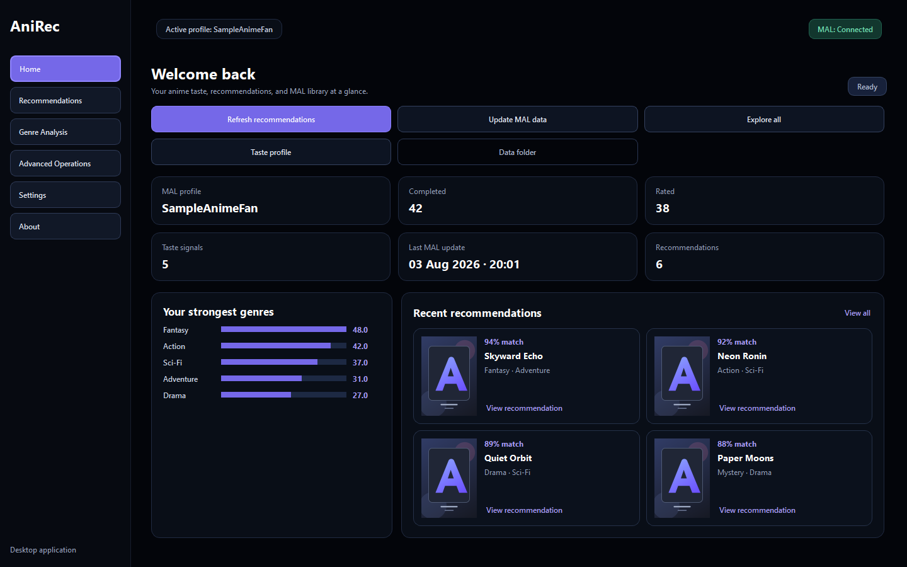
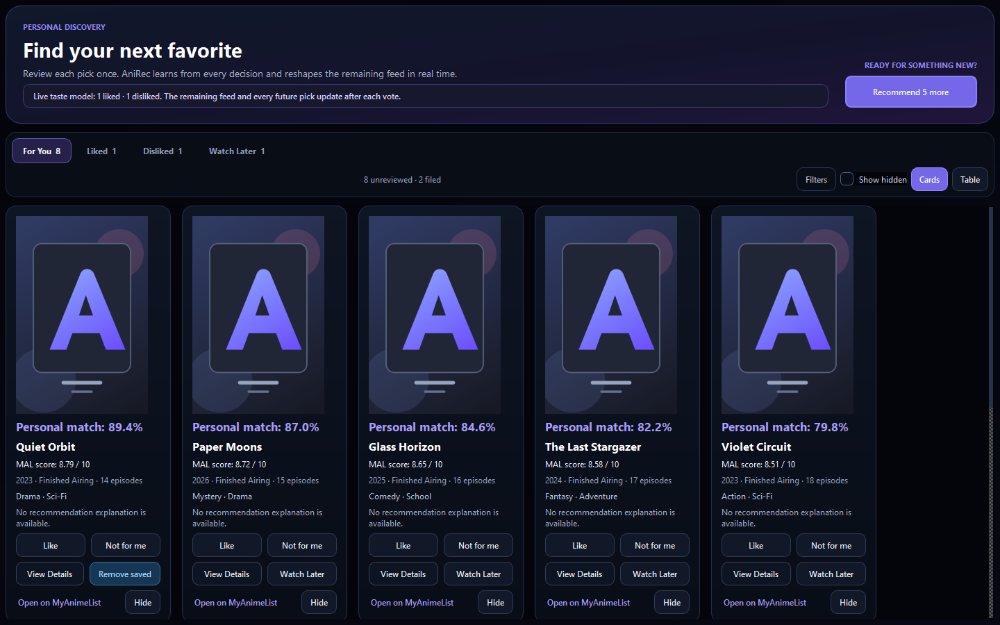
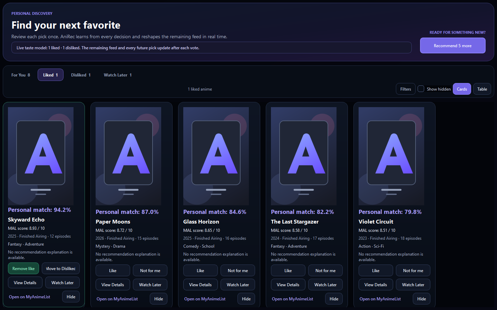
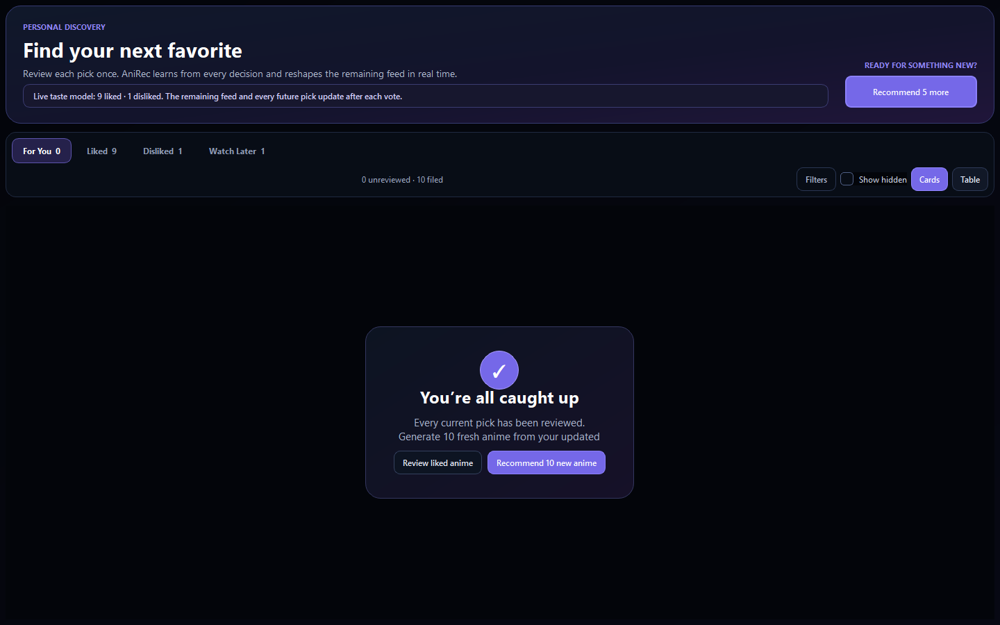
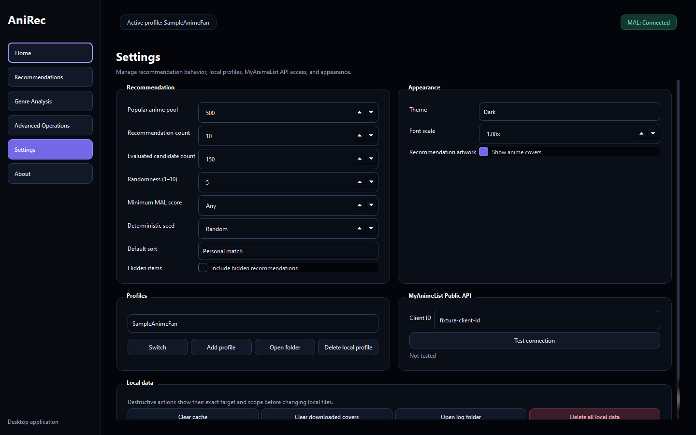

# AniRec

AniRec 1.2.2 is an open-source Windows desktop application that turns a MyAnimeList history into explainable, genre-based anime recommendations. It includes a PySide6 GUI, a reusable service pipeline, and the original command-line workflow.

AniRec is unofficial and is not affiliated with or endorsed by MyAnimeList.

## Desktop application

The English desktop interface provides:

- a three-step first-run setup using a Client ID, public MAL profile URL, and initial analysis;
- a modern Home dashboard with working MAL sync/generation actions, genre strength bars, and cover-based recent recommendation cards;
- compact card and table recommendation views with filters, sorting, lazy cover loading, and reusable details;
- personal-match explanations and per-genre score contributions;
- profile-local Hidden, Watch Later, Like, and Not for me state keyed by MyAnimeList anime ID;
- adaptive, explainable reranking that updates the remaining feed after every explicit vote;
- always-visible **For You**, **Liked**, **Disliked**, and **Watch Later** tabs with live counts and editable saved states;
- **Recommend 5 more** plus an automatic 10-pick refill prompt when the active feed is exhausted;
- genre analysis summaries and a detailed genre table;
- independently runnable advanced pipeline steps with explicit prerequisites;
- multi-profile, API, recommendation, appearance, cache, cover, log, and local-data settings;
- OLED-black dark, light, and system themes with adjustable font scale;
- cancellable background work, guarded retry, automatically closing successful progress dialogs, safe error dialogs, and redacted logs.












## Requirements

- Windows 10 or 11 for the packaged desktop build
- Python 3.10 or newer when running from source
- A MyAnimeList API application and a public MyAnimeList anime list

The packaged `onedir` build includes Python and its runtime libraries. End users do not need to install Python.

## Run from source

From the repository root in PowerShell:

```powershell
python -m venv .venv
.\.venv\Scripts\Activate.ps1
python -m pip install -r requirements.txt
python anirec_gui.py
```

The equivalent module entry is:

```powershell
python -m AniRec.gui_main
```

## MyAnimeList setup

Create a non-commercial, hobbyist MyAnimeList API application. The MAL registration
form requires a redirect URL; use:

```text
http://localhost:8080/callback
```

On first launch:

1. Enter the MyAnimeList Client ID.
2. Enter either the username or the complete profile URL, for example
   `https://myanimelist.net/profile/example_user`.
3. Choose **Validate and Continue**. AniRec verifies both the Client ID and the
   public completed-anime list in one background operation.
4. Choose **Connect with MyAnimeList** and approve AniRec in the browser. AniRec
   never receives or stores the MAL account password.
5. Review the recommendation defaults and run the initial analysis.

Client ID access remains sufficient for public ranking and list reads, while first-run
setup now also records profile-scoped OAuth approval. The connection can later be
revalidated from Advanced Operations. Enable **Include NSFW anime** in Settings when
MAL's NSFW-labelled titles should be included in both history analysis and the Top Anime
candidate pool.

Never commit or share a Client Secret, authorization code, access token, refresh
token, profile directory, or log file. Follow MyAnimeList's instructions for the
Client ID even though it is used locally by AniRec.

## Run the Windows package

Keep the complete `dist\AniRec` directory together, then launch:

```text
dist\AniRec\AniRec.exe
```

The executable uses the Windows GUI subsystem and does not open a console. It is currently unsigned, so Windows SmartScreen or antivirus software may ask for confirmation. Download or run it only from a source you trust.

## Build the Windows package

Install the build dependencies and run the tracked clean build script:

```powershell
.\.venv\Scripts\python.exe -m pip install -r requirements-build.txt
.\scripts\build_windows.ps1
```

The script builds [AniRec.spec](AniRec.spec) with PyInstaller and produces:

```text
dist\AniRec\AniRec.exe
```

The `onedir` package includes the original application icon, light/dark QSS, placeholders, asset licensing, GPL-3.0 license, Qt runtime, and Python dependencies. `build/` and `dist/` are generated locally and ignored by Git. A `onefile` build is intentionally not shipped in 1.2.2.

## Command-line interface

The original CLI remains available from source:

```powershell
python -m AniRec.cli
```

It offers a guided full pipeline and a step-by-step mode. For the legacy CLI OAuth flow, set the environment variables before launch:

```powershell
$env:MAL_CLIENT_ID="your_client_id"
$env:MAL_CLIENT_SECRET="your_client_secret" # optional when the API client permits it
$env:MAL_REDIRECT_URI="http://localhost:8080/callback"
python -m AniRec.cli
```

Do not store real credentials in `.env.example`; that file contains placeholders only.

## Recommendation pipeline

AniRec uses an explainable content-based workflow, not a collaborative-filtering or generative model:

1. Fetch ranked anime and the user's completed list from MyAnimeList.
2. Impute missing or zero user scores from genre medians.
3. Calculate per-genre preference importance.
4. Remove completed anime by MyAnimeList ID.
5. Score candidates from genre contributions.
6. Apply deterministic, configurable variety and return ranked recommendations.
7. Apply profile-local Like/Not for me genre affinities to current and future ranking while keeping the adjustment bounded and explainable.

Like/Not for me is an adaptive content-ranking signal, not a generative AI or a cloud-trained model. Feedback stays in the local profile. Each vote moves the anime into its Liked or Disliked tab and immediately reranks the unreviewed feed. Opening a collection lets the user remove a saved vote or move it to the opposite collection; Watch Later can be inspected and cleared the same way. Selecting **Recommend 5 more** reads the already generated candidate pool, excludes anime already shown, and appends five unseen picks. When every current pick has been reviewed, the same background pipeline offers ten fresh picks based on the latest feedback.

Generated CSV and JSON results are profile-scoped. The UI exposes the recommendation reason and genre contribution values used by the ranker.

## Local data and privacy

AniRec stores writable data outside the program and repository under:

```text
%APPDATA%\AniRec\
```

| Directory | Contents |
|---|---|
| `config\` | Application settings, active profile, onboarding state |
| `tokens\` | Profile-scoped OAuth tokens |
| `profiles\` | Profile metadata, generated CSV/JSON results, local recommendation state |
| `cache\covers\` | Validated downloaded cover images |
| `logs\` | Rotating, secret-redacted diagnostic logs |

Client Secrets and OAuth tokens are protected by the current Windows user account and filesystem permissions, but 1.2.2 does not use Windows Credential Manager or another encrypted secret vault. Use **Settings → Data Management** for scoped cache, cover, or local-data deletion. Deletion requires an exact validated target and never follows an outside path.

## Tests

Install development dependencies and run the complete networkless suite:

```powershell
.\.venv\Scripts\python.exe -m pip install -r requirements-dev.txt
.\.venv\Scripts\python.exe -m pytest -q
```

The suite uses mock/fault injection instead of a real account. It covers the recommendation pipeline, adaptive feedback, visible/editable taste collections, vote-driven reranking, five/ten-pick exclusion, public Client ID access, optional OAuth internals, persistence, profiles, GUI navigation, wizard, workers, success auto-close, retry/cancellation, compact cards/details, responsive library controls, settings, data deletion, path/link safety, secret redaction, packaging contracts, and offline/timeout/rate-limit/storage failures. Implicit `%APPDATA%` access is isolated per test.

The development-machine packaged-EXE matrix is recorded in [docs/EXE_SMOKE.md](docs/EXE_SMOKE.md).

## Troubleshooting

### Client ID is rejected

Confirm the Client ID was copied without whitespace and choose **Validate and Continue** again. A Client Secret cannot repair an invalid Client ID.

### Profile cannot be validated

Use either the username or an exact `https://myanimelist.net/profile/...` URL.
Confirm that the account's anime list is public, then retry.

### Offline, timeout, rate-limit, or server error

Use **Try Again** only after connectivity returns or the retry interval has passed. **Show technical details** contains a redacted summary; **Open Log Folder** opens the diagnostic location without displaying a traceback.

### Covers do not load

AniRec accepts bounded HTTPS JPEG, PNG, and WebP data with a matching file signature. Invalid, oversized, empty, or timed-out responses fall back to the original placeholder. Clear downloaded covers in Settings to request them again.

### Start over locally

Use the scoped controls in **Settings → Data Management**. Back up anything needed first; deleting all local AniRec data removes settings, tokens, profiles, generated results, cache, covers, and logs.

## Project layout

```text
AniRec/
├── AniRec/                    # Application package
│   ├── application/           # Pipeline orchestration
│   ├── core/                  # MAL mapping and shared domain logic
│   ├── gui/                   # PySide6 pages, dialogs, resources, workers
│   ├── infrastructure/        # HTTP, storage, paths, callback, logging
│   ├── models/                # Versioned domain and settings models
│   └── services/              # UI-independent application services
├── tests/                     # Networkless regression and GUI smoke tests
├── docs/                      # Verified screenshots and EXE smoke evidence
├── packaging/                 # Windows version resource
├── scripts/build_windows.ps1  # Clean PyInstaller build
├── AniRec.spec                # Tracked onedir package definition
├── anirec_gui.py              # Desktop launcher
└── README.md
```

## License and attribution

AniRec is licensed under the [GNU General Public License v3.0](LICENSE).

- Original project owner: [YusBera](https://github.com/YusBera)
- Desktop GUI contribution: a PySide6 interface built on the original AniRec project
- Original GUI assets and their licensing: [AniRec/gui/resources/ASSET_LICENSES.md](AniRec/gui/resources/ASSET_LICENSES.md)

## Known limitations in 1.2.2

- The algorithm is intentionally genre-based and does not use collaborative filtering.
- Live recommendations require a user-provided MyAnimeList Client ID and a public anime list.
- The release candidate was exercised on the development Windows 11 machine; a second Windows 10/11 computer acceptance run is still required.
- Real public-profile integration was verified without displaying or persisting anime titles in test output.
- The package is unsigned and distributed as `onedir`; there is no installer, auto-update, code signing, or `onefile` artifact.
- Local secrets are not stored in an encrypted operating-system credential vault.
