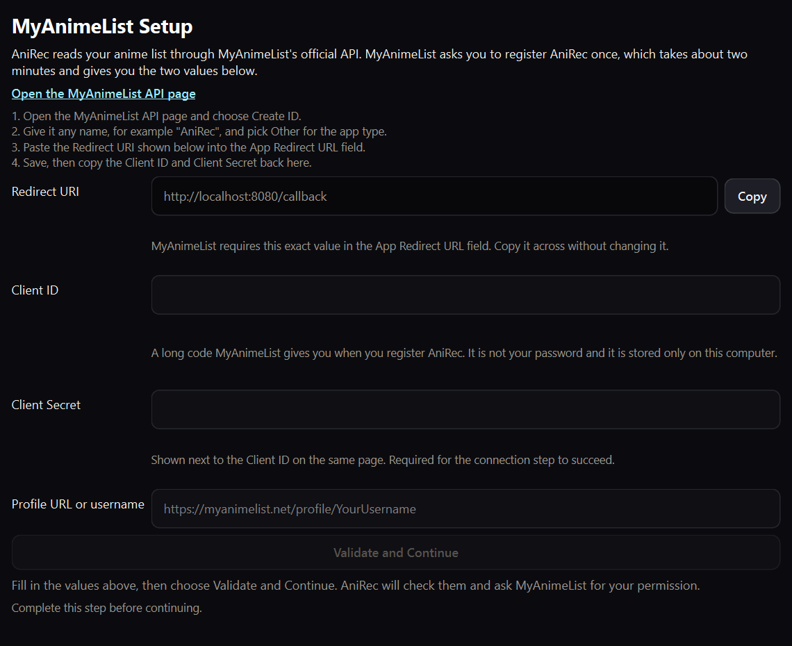
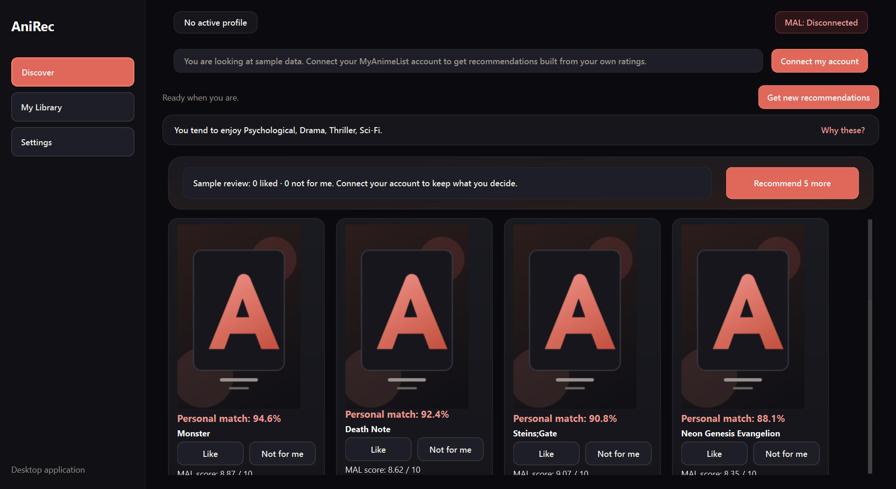
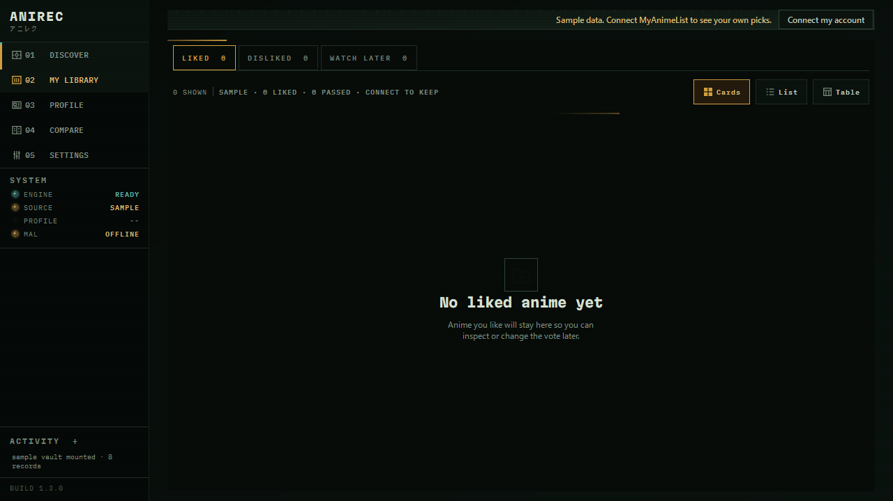
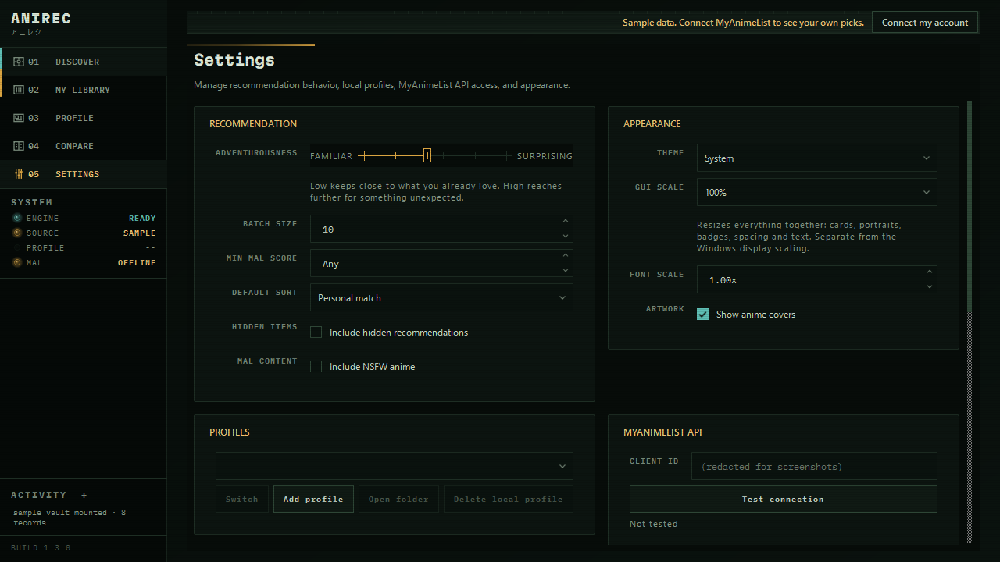

# AniRec

AniRec 2.0.0 is an open-source Windows desktop application that turns a MyAnimeList history into anime recommendations you can actually interrogate. Every score comes with a breakdown that adds up to it. It includes a PySide6 GUI, a reusable service pipeline, and the original command-line workflow.

AniRec is unofficial and is not affiliated with or endorsed by MyAnimeList.

## Desktop application

The English desktop interface provides:

- three surfaces: **Discover**, **My Library**, and **Settings**;
- a guided first run that links to the MyAnimeList API page, shows the exact redirect URI with a copy button, and explains every value it asks for;
- a **look around with sample data** mode that needs no account at all;
- recommendations scored from a learned taste profile, with a breakdown for each one that sums to the match percentage shown beside it;
- a **Why these?** summary naming the genres driving the feed, including the ones AniRec has learned you avoid;
- profile-local Liked, Not for me, and Watch Later collections keyed by MyAnimeList anime ID;
- **Recommend 5 more** plus an automatic refill prompt when the feed is exhausted;
- a single **Adventurousness** control in place of the sampler's internals;
- optional developer tools exposing the individual data steps;
- warm cinematic dark and light themes generated from one set of design tokens, with a font scale that moves the whole type hierarchy;
- cancellable background work, guarded retry, safe error dialogs, and redacted logs.









## Requirements

- Windows 10 or 11 for the packaged desktop build
- Python 3.10 or newer when running from source
- A MyAnimeList API application and a public MyAnimeList anime list

The packaged `onedir` build includes Python and its runtime libraries. End users do not need to install Python.

## Run from source

From the repository root in PowerShell:

```powershell
python -m venv .venv
.\.venv\Scripts\Activate.ps1
python -m pip install -r requirements.txt
python anirec_gui.py
```

The equivalent module entry is:

```powershell
python -m AniRec.gui_main
```

## MyAnimeList setup

Create a non-commercial, hobbyist MyAnimeList API application. The MAL registration
form requires a redirect URL; use:

```text
http://localhost:8080/callback
```

On first launch:

1. Enter the MyAnimeList Client ID.
2. Enter either the username or the complete profile URL, for example
   `https://myanimelist.net/profile/example_user`.
3. Choose **Validate and Continue**. AniRec verifies both the Client ID and the
   public completed-anime list in one background operation.
4. Choose **Connect with MyAnimeList** and approve AniRec in the browser. AniRec
   never receives or stores the MAL account password.
5. Review the recommendation defaults and run the initial analysis.

Client ID access remains sufficient for public ranking and list reads, while first-run
setup now also records profile-scoped OAuth approval. The connection can later be
revalidated from Advanced Operations. Enable **Include NSFW anime** in Settings when
MAL's NSFW-labelled titles should be included in both history analysis and the Top Anime
candidate pool.

Never commit or share a Client Secret, authorization code, access token, refresh
token, profile directory, or log file. Follow MyAnimeList's instructions for the
Client ID even though it is used locally by AniRec.

## Run the Windows package

Keep the complete `dist\AniRec` directory together, then launch:

```text
dist\AniRec\AniRec.exe
```

The executable uses the Windows GUI subsystem and does not open a console. It is currently unsigned, so Windows SmartScreen or antivirus software may ask for confirmation. Download or run it only from a source you trust.

## Build the Windows package

Install the build dependencies and run the tracked clean build script:

```powershell
.\.venv\Scripts\python.exe -m pip install -r requirements-build.txt
.\scripts\build_windows.ps1
```

The script builds [AniRec.spec](AniRec.spec) with PyInstaller and produces:

```text
dist\AniRec\AniRec.exe
```

The `onedir` package includes the original application icon, light/dark QSS, placeholders, asset licensing, GPL-3.0 license, Qt runtime, and Python dependencies. `build/` and `dist/` are generated locally and ignored by Git. A `onefile` build is intentionally not shipped in 1.2.2.

## Command-line interface

The original CLI remains available from source:

```powershell
python -m AniRec.cli
```

It offers a guided full pipeline and a step-by-step mode. For the legacy CLI OAuth flow, set the environment variables before launch:

```powershell
$env:MAL_CLIENT_ID="your_client_id"
$env:MAL_CLIENT_SECRET="your_client_secret" # optional when the API client permits it
$env:MAL_REDIRECT_URI="http://localhost:8080/callback"
python -m AniRec.cli
```

Do not store real credentials in `.env.example`; that file contains placeholders only.

## How recommendations are made

AniRec scores candidates from your own rating history. It is not a generative model, and nothing is sent to a third party beyond the MyAnimeList API calls it makes on your behalf.

1. Fetch ranked anime and your completed list from MyAnimeList.
2. Build a taste profile from the titles you actually rated. Ratings are centred on your own average, so a generous rater and a harsh one produce comparable profiles, and each feature is shrunk toward neutral according to how much evidence supports it. A genre you rate below your average carries a negative affinity.
3. Describe each anime by genre, studio, source, media type, and era, weighting rarer features more heavily because they say more about taste.
4. Score by cosine similarity, so a broadly tagged title cannot outrank a precise match simply by carrying more tags.
5. Blend in a confidence-weighted community score, so an obscure title with a handful of perfect ratings does not displace a widely loved one, and optionally a collaborative signal walked outward from your highest rated titles.
6. Calibrate to a percentage using fixed constants, so a title scores the same whatever else is ranked alongside it.
7. Apply your Liked and Not for me votes in exactly one place, bounded so repeated votes converge rather than saturate.

Because the total is a weighted sum, and cosine is itself a sum over features, each feature's share is an exact identity rather than an estimate. That is why the breakdown shown against a recommendation adds up to the percentage beside it, including negative contributions and the community rating.

Generated CSV and JSON results are profile-scoped.

## Local data and privacy

AniRec stores writable data outside the program and repository under:

```text
%APPDATA%\AniRec\
```

| Directory | Contents |
|---|---|
| `config\` | Application settings, active profile, onboarding state |
| `tokens\` | Profile-scoped OAuth tokens |
| `profiles\` | Profile metadata, generated CSV/JSON results, local recommendation state |
| `cache\covers\` | Validated downloaded cover images |
| `logs\` | Rotating, secret-redacted diagnostic logs |

Client Secrets and OAuth tokens are protected by the current Windows user account and filesystem permissions, but 1.2.2 does not use Windows Credential Manager or another encrypted secret vault. Use **Settings → Data Management** for scoped cache, cover, or local-data deletion. Deletion requires an exact validated target and never follows an outside path.

## Tests

Install development dependencies and run the complete networkless suite:

```powershell
.\.venv\Scripts\python.exe -m pip install -r requirements-dev.txt
.\.venv\Scripts\python.exe -m pytest -q
```

The suite uses mock and fault injection instead of a real account, and isolates implicit `%APPDATA%` access per test. It covers the scoring engine, the pipeline, taste collections and vote-driven reranking, first-run setup and the connection step, persistence, profiles, navigation, workers, cancellation and retry, settings, data deletion, path and link safety, secret redaction, packaging contracts, and offline, timeout, rate-limit and storage failures.

[tests/test_scoring_invariants.py](tests/test_scoring_invariants.py) states the properties the recommender must satisfy whatever the formula: that a match percentage does not depend on what else was ranked beside it, that the parts of an explanation add up to the score shown, that a genre you rate poorly is never presented as a reason to watch something, and that evidence tempers enthusiasm.

The development-machine packaged-EXE matrix is recorded in [docs/EXE_SMOKE.md](docs/EXE_SMOKE.md).

## Troubleshooting

### Client ID is rejected

Confirm the Client ID was copied without whitespace and choose **Validate and Continue** again. A Client Secret cannot repair an invalid Client ID.

### Profile cannot be validated

Use either the username or an exact `https://myanimelist.net/profile/...` URL.
Confirm that the account's anime list is public, then retry.

### Offline, timeout, rate-limit, or server error

Use **Try Again** only after connectivity returns or the retry interval has passed. **Show technical details** contains a redacted summary; **Open Log Folder** opens the diagnostic location without displaying a traceback.

### Covers do not load

AniRec accepts bounded HTTPS JPEG, PNG, and WebP data with a matching file signature. Invalid, oversized, empty, or timed-out responses fall back to the original placeholder. Clear downloaded covers in Settings to request them again.

### Start over locally

Use the scoped controls in **Settings → Data Management**. Back up anything needed first; deleting all local AniRec data removes settings, tokens, profiles, generated results, cache, covers, and logs.

## Project layout

```text
AniRec/
├── AniRec/                    # Application package
│   ├── application/           # Pipeline orchestration
│   ├── core/                  # MAL mapping and shared domain logic
│   ├── gui/                   # PySide6 pages, dialogs, resources, workers
│   ├── infrastructure/        # HTTP, storage, paths, callback, logging
│   ├── models/                # Versioned domain and settings models
│   ├── scoring/               # Taste profile, feature vocabulary, ranking
│   └── services/              # UI-independent application services
├── tests/                     # Networkless regression and GUI smoke tests
├── docs/                      # Screenshots, release notes, acceptance evidence
├── packaging/                 # Windows version resource
├── scripts/build_windows.ps1  # Clean PyInstaller build
├── scripts/build_theme.py     # Regenerate the stylesheets from design tokens
├── scripts/build_icon.py      # Regenerate the Windows icon from the SVG
├── AniRec.spec                # Tracked onedir package definition
├── anirec_gui.py              # Desktop launcher
└── README.md
```

## License and attribution

AniRec is licensed under the [GNU General Public License v3.0](LICENSE).

- Original project owner: [YusBera](https://github.com/YusBera)
- Desktop GUI contribution: a PySide6 interface built on the original AniRec project
- Original GUI assets and their licensing: [AniRec/gui/resources/ASSET_LICENSES.md](AniRec/gui/resources/ASSET_LICENSES.md)

## Known limitations in 2.0.0

- The collaborative signal uses MyAnimeList's own recommendation edges. It is optional, cached, and absent by default until a run has walked the graph.
- Live recommendations require a user-provided MyAnimeList Client ID and Secret, and a public anime list.
- 2.0.0 was exercised on the development Windows 11 machine; a second Windows 10/11 computer acceptance run is still required.
- The package is unsigned and distributed as `onedir`; there is no installer, auto-update, code signing, or `onefile` artifact.
- Local secrets are not stored in an encrypted operating-system credential vault.
